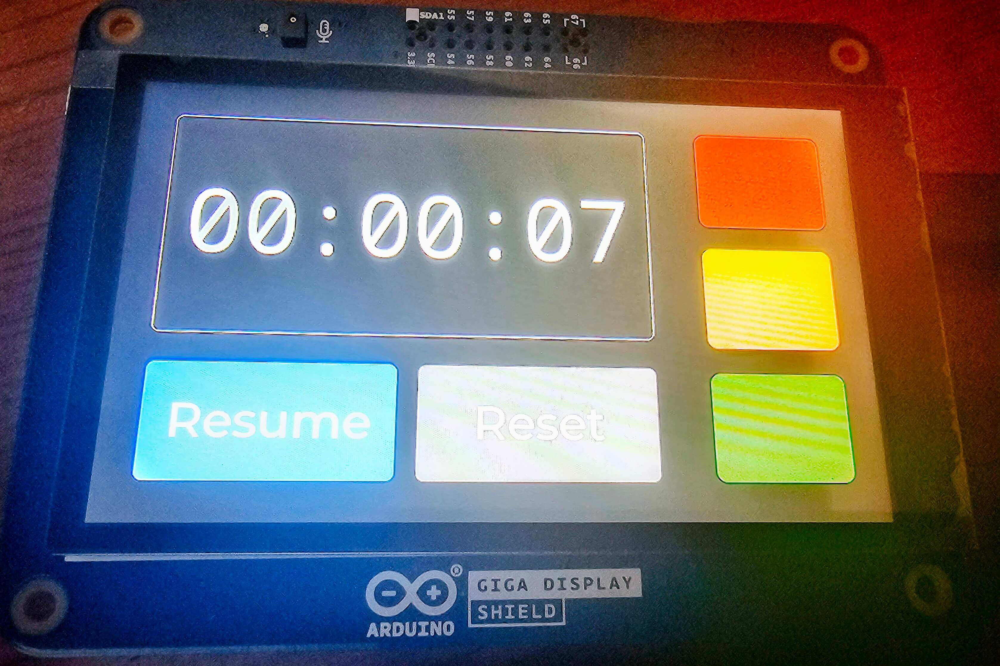

# Prototype In Wall Display Timer CTL

Arduino-controlled display timer prototype with start/stop/reset capabilities.

This project requires the use of Arduino libraries and prototype designed to specifically to work with GIGA displays. This is just an open-source subset of display prototypes with unique controls.
